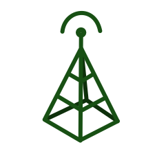

# Supported tags and respective `Dockerfile` links

-	[`1.6.1-debian-dirty-es-es`, `1.6-debian-dirty-es-es`, `latest-debian-dirty-es-es`, `latest` (*joserprieto/debian/nodejs/7.4.0/dirty/Dockerfile*)](https://github.com/joserprieto/docker-etherpad/blob/master/joserprieto/debian/nodejs/7.4.0/dirty/Dockerfile)

# What is Etherpad?

Etherpad is a really-real time collaborative editor maintained by the Etherpad Community.

Etherpad is written in JavaScript (99.9%) on both the server and client so it's easy for developers to maintain and add new features.  Because of this Etherpad has tons of customizations that you can leverage.

Etherpad is designed to be easily embeddable and provides a [HTTP API](https://github.com/ether/etherpad-lite/wiki/HTTP-API)
that allows your web application to manage pads, users and groups. It is recommended to use the [available client implementations](https://github.com/ether/etherpad-lite/wiki/HTTP-API-client-libraries) in order to interact with this API. 

There is also a [jQuery plugin](https://github.com/ether/etherpad-lite-jquery-plugin) that helps you to embed Pads into your website.

There's also a full-featured plugin framework, allowing you to easily add your own features.  By default your Etherpad is rather sparse and because Etherpad takes a lot of it's inspiration from Wordpress plugins are really easy to install and update.  Once you have Etherpad installed you should visit the plugin page and take control.

Finally, Etherpad comes with translations into most languages!  Users are automatically delivered the correct language for their local settings.

**Visit [beta.etherpad.org](http://beta.etherpad.org) to test it live.**

Also, check out the **[FAQ](https://github.com/ether/etherpad-lite/wiki/FAQ)**, really!

<!--%%LOGO%%-->

# About this image

Docker image for Etherpad Lite collaborative text editor, with support for locale and timezone, before build the image.